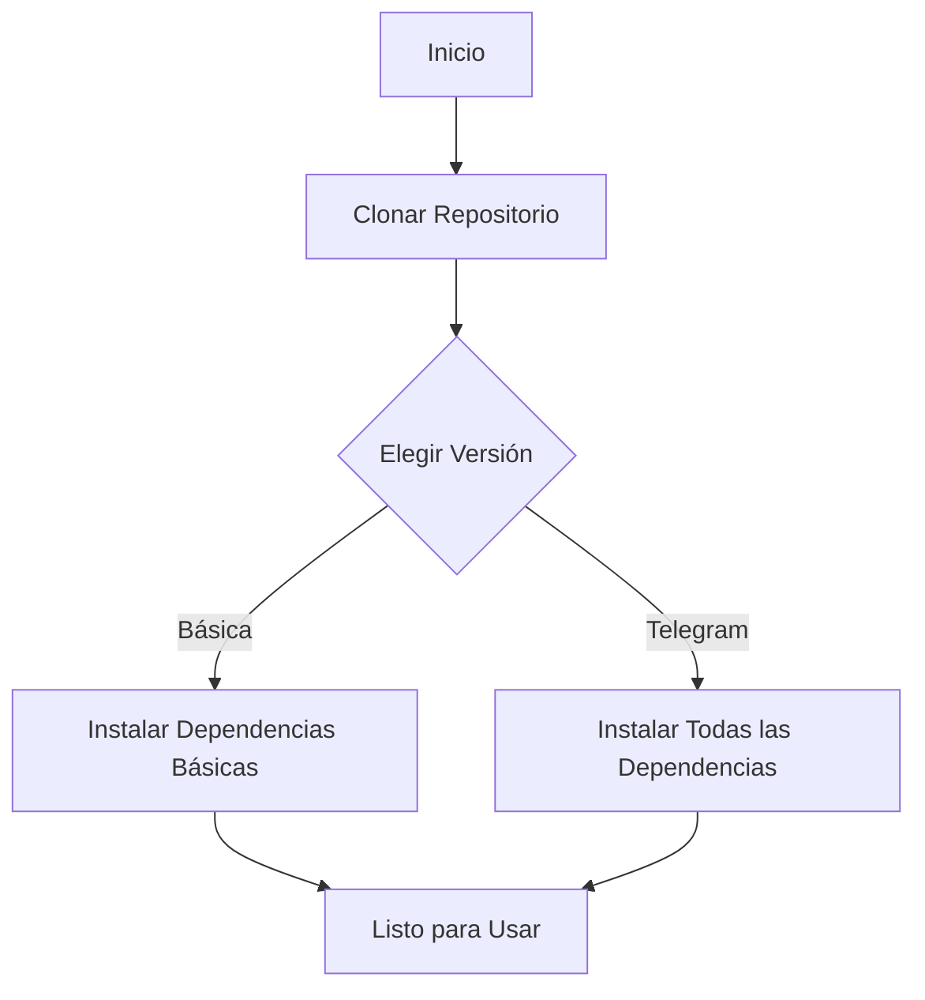
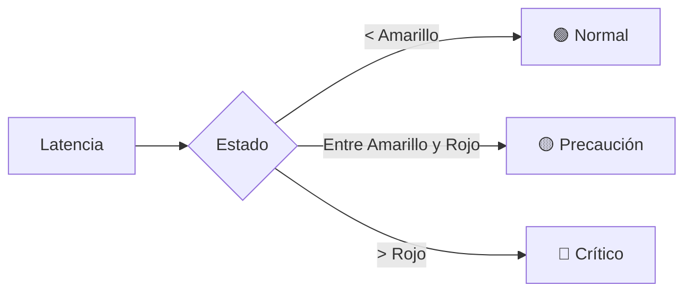

# 🌐 Guía de Uso de Ping-Monitor

<p align="center">
  
</p>

## 🚀 Introducción

Ping-Monitor es tu compañero ideal para el monitoreo de red en tiempo real. Disponible en dos potentes versiones:

| Versión | Características |
|---------|-----------------|
| 🔹 **Básica** | Monitoreo simple y efectivo |
| 🔷 **Telegram** | Notificaciones avanzadas + Monitoreo de recursos |

---

## 📦 Instalación



1. **Clonar el repositorio:**
   ```bash
   git clone https://github.com/panxos/Ping-Monitor.git
   cd Ping-Monitor
   ```

2. **Instalar dependencias:**
   - 🔹 Versión Básica:
     ```bash
     pip install -r requirements_basic.txt
     ```
   - 🔷 Versión Telegram:
     ```bash
     pip install -r requirements.txt
     ```

---

## 💻 Uso Rápido

### 🔹 Versión Básica
```bash
python ping-monitor-script.py [host] [opciones]
```

### 🔷 Versión Telegram
```bash
python ping-monitor-script-telegram.py [host] [opciones]
```

---

## 🛠️ Opciones y Configuración

### Opciones Comunes

| Opción | Descripción | Valor por Defecto |
|:------:|-------------|:-----------------:|
| `host` | IP o hostname a monitorear | (Requerido) |
| `--log` | Archivo de registro | network_monitor.log |
| `--interval` | Intervalo entre pings (seg) | 1 |
| `--yellow` | Umbral amarillo (ms) | 100 |
| `--red` | Umbral rojo (ms) | 300 |
| `--tracer` | Ejecutar traceroute al final | False |

### 🔷 Opciones Exclusivas de Telegram

| Opción | Descripción |
|:------:|-------------|
| `--telegram_token` | Token del bot |
| `--telegram_chat_id` | ID del chat |
| `--save_config` | Guardar configuración |

---

## 🌈 Guía Visual de Estados



---

## 📊 Ejemplos Prácticos

### 🔹 Versión Básica

1. **Monitoreo Estándar:**
   ```bash
   python ping-monitor-script.py 8.8.8.8
   ```

2. **Configuración Personalizada:**
   ```bash
   python ping-monitor-script.py 8.8.8.8 --interval 2 --yellow 150 --red 400
   ```

### 🔷 Versión Telegram

1. **Configuración Inicial:**
   ```bash
   python ping-monitor-script-telegram.py 8.8.8.8 --telegram_token YOUR_TOKEN --telegram_chat_id YOUR_CHAT_ID --save_config
   ```

2. **Uso Posterior:**
   ```bash
   python ping-monitor-script-telegram.py 8.8.8.8
   ```

---

## 📱 Configuración de Telegram

1. Crear bot con @BotFather
2. Obtener Chat ID:
   ```
   https://api.telegram.org/botTU_TOKEN/getUpdates
   ```
3. Buscar: `"chat":{"id":XXXXXXXX}`

---

## 🔍 Solución de Problemas

| Problema | Solución |
|----------|----------|
| 🔕 No hay notificaciones | Verificar token y chat ID |
| 🚫 Error de permisos | Ejecutar como administrador |
| 📚 Dependencias faltantes | Reinstalar requirements |

---

## 🆘 Ayuda Adicional

Para más detalles:
```bash
python ping-monitor-script.py --help
python ping-monitor-script-telegram.py --help
```

<p align="center">
  <strong>¿Preguntas? ¡Abre un issue en nuestro GitHub!</strong>
</p>

---

<p align="center">
  Desarrollado con ❤️ por Francisco Aravena (P4nx0z)
</p>
